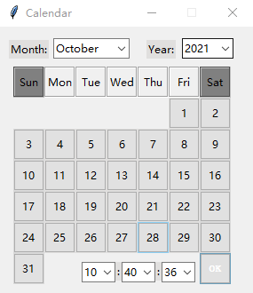

# A Date Time Calendar by tkinter

A date time calendar by tkinter modified from 『[GAUTAM SHARMA](https://codingshiksha.com/python/python-3-tkinter-dropdown-formatted-calendar-widget-with-date-and-time-gui-script-desktop-app-full-project-for-beginners/)』 by GAUTAM SHARMA




## How To Use
```python
#!/usr/bin/env python3
import tkinter
from tkdtcalendar import DateTimeCalendar


def callback(result):
        print(result)   # prints the date_time dict

root = tkinter.Tk()
calendar = DateTimeCalendar(root)
root.mainloop()
date_time = calendar.get_date_time()
# the keys are: 'year', 'month', 'day', 'hours', 'minutes' and 'seconds'
print(date_time['year'])
print(date_time['minutes'])
```

## License
tkdtcalendar is available under the MIT license. See the LICENSE file for more info.
